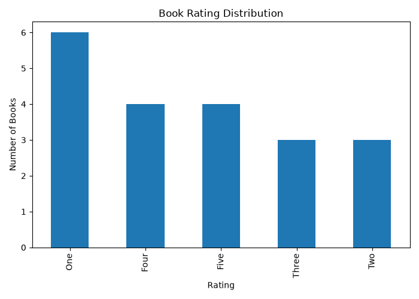
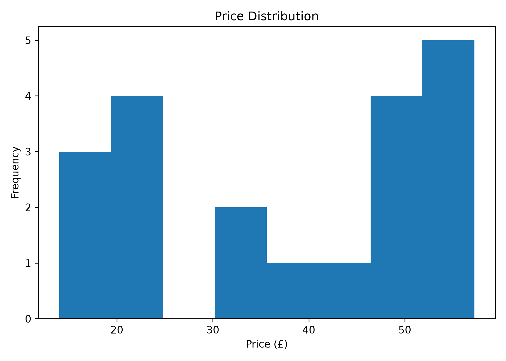
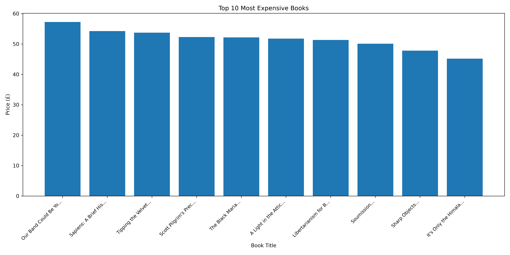

#  CodeAlpha Data Analytics Internship - Task 1: Web Scraping

##  Project Overview

This project was completed as part of the **CodeAlpha Data Analytics Internship**.

The objective of this project is to scrape book information from the Books to Scrape website, clean the collected data, perform basic data analysis, and visualize insights using Python.

Website Used:
http://books.toscrape.com/

---

##  Features

- Web scraping using Requests and BeautifulSoup
- Extracts:
  - Book Title
  - Price
  - Rating
  - Availability
- Stores data in a Pandas DataFrame
- Cleans the price column
- Performs basic data analysis
- Creates visualizations
- Saves the dataset as CSV

---

##  Technologies Used

- Python
- Requests
- BeautifulSoup4
- Pandas
- Matplotlib

---

##  Data Analysis Performed

- Total number of books
- Average book price
- Highest priced book
- Lowest priced book
- Rating distribution
- Availability count
- Statistical summary

---

##  Visualizations

### Rating Distribution

---

### Price Distribution

---

### Top 10 Most Expensive Books

---

##  Output

The project generates:

- books.csv
- rating_distribution.png
- price_distribution.png
- top10_expensive_books.png

---

##  How to Run

Clone the repository

git clone https://github.com/yuvedhadhandapani2008-cmd/CodeAlpha_WebScraping.git

Install dependencies

pip install -r requirements.txt

Run the project

python web_scraping.py

---

##  Sample Output

The script extracts details such as:

- Title
- Price
- Rating
- Availability

and saves them into a CSV file.

---

##  Author

Yuvedha Dhandapani

Data Analytics Intern — CodeAlpha

---

## ⭐ If you found this project useful, consider giving it a star on GitHub!
